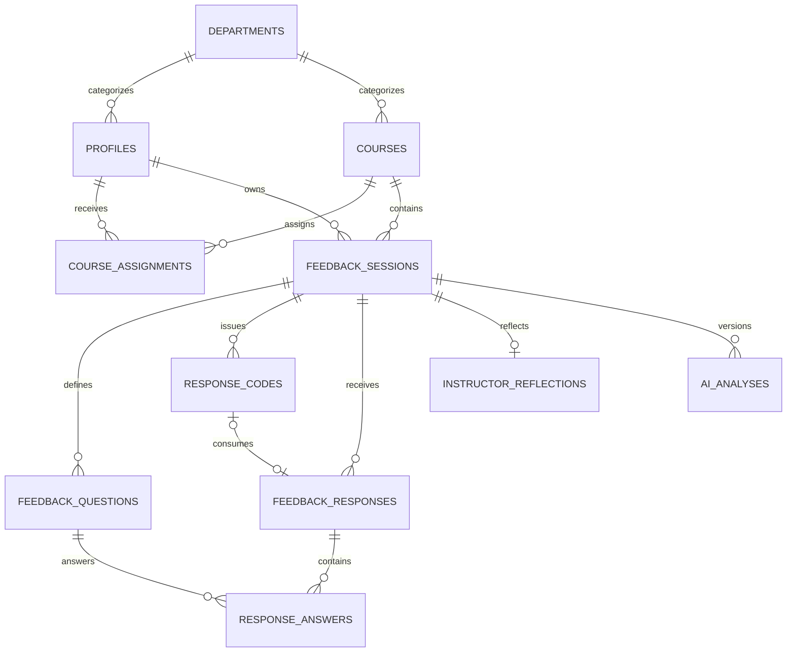

# Database design

## Tables

- `departments`: simple instructor/course categorization.
- `profiles`: Supabase Auth extension with role and active state.
- `courses`: administrator-managed institutional course catalog.
- `course_assignments`: many-to-many links between catalog courses and active instructors.
- `feedback_sessions`: lecture/activity feedback lifecycle and material metadata.
- `feedback_questions`: ordered rating, single-choice, or long-text prompts.
- `response_codes`: single-use SHA-256 code hashes and consumption link.
- `feedback_responses`: anonymous submission headers.
- `response_answers`: typed answer values, one per question and response.
- `instructor_reflections`: one complete reflection per session.
- `ai_analyses`: immutable versioned structured results.
- `submission_rate_limits`: service-role-only short-window counters.

## Relationships

## Constraints and indexes

Checks enforce session windows, valid slugs, expected-response bounds, question option shape, 1–5 ratings, 1,000-character written answers, one answer value per row, and consistent code consumption. Unique constraints prevent duplicate catalog course codes, duplicate course assignments, duplicate question positions, duplicate code hashes per session, and multiple reflections. Partial and compound indexes support assignment lookups, ownership queries, session dashboards, unused-code counts, ordered questions, and newest-first analyses.

## RLS summary

Instructors can read only courses assigned to them and cannot create or edit catalog courses or assignments. They can create sessions only for assigned courses, then mutate only their own sessions, questions, codes, reflections, materials, and analyses. Admins manage departments, catalog courses, assignments, and instructor states, but do not perform instructor reflection or analysis workflows. Anonymous users receive no table policies; their access is through the two carefully scoped public functions.
